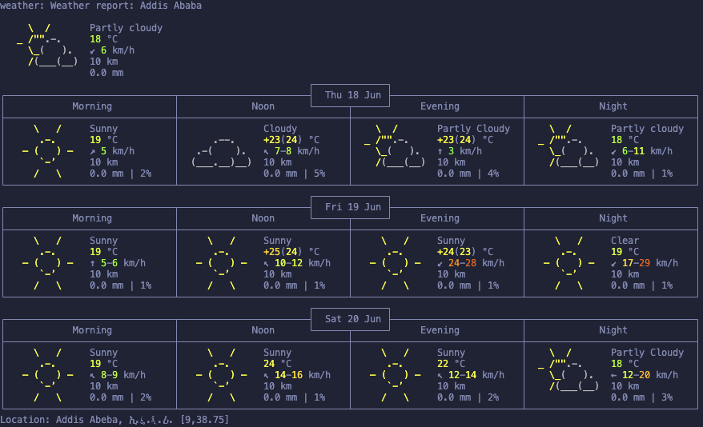

# My MCP Server

A lightweight [Model Context Protocol (MCP)](https://modelcontextprotocol.io) server built with [FastMCP](https://github.com/jlowin/fastmcp), exposing three tools that can be used by any MCP-compatible client (Claude Desktop, agents, etc.).

## Tools

| Tool                  | Description                                               | Input              |
| --------------------- | --------------------------------------------------------- | ------------------ |
| `add`                 | Adds two integers together                                | `a: int`, `b: int` |
| `get_current_time`    | Returns the current date and time as an ISO string        | none               |
| `get_current_weather` | Fetches a 3-day weather forecast for any city via wttr.in | `city: str`        |

## Demo

Weather forecast for Addis Ababa fetched live via the `get_current_weather` tool:



## Tech Stack

- Python 3.12
- [FastMCP](https://github.com/jlowin/fastmcp) — MCP server framework
- [wttr.in](https://wttr.in) — free weather API (no key required)
- [uv](https://github.com/astral-sh/uv) — package and environment management

## Getting Started

**1. Clone the repo:**

```bash
git clone https://github.com/aarongeb/mcp.git
cd mcp
```

**2. Create a virtual environment and install dependencies:**

```bash
uv venv --python 3.12
source .venv/bin/activate
uv pip install -r requirements.txt   # or: uv sync if using pyproject.toml
```

**3. Set up environment variables:**

```bash
cp .env.example .env
# optionally set MCP_PORT in .env (default: 3000)
```

**4. Run the server:**

```bash
./server.py
```

The server starts on `http://127.0.0.1:3000` (SSE transport).

## Environment Variables

| Variable   | Description                | Default |
| ---------- | -------------------------- | ------- |
| `MCP_PORT` | Port the server listens on | `3000`  |

## Testing the Tools

**With the FastMCP test client:**

```python
# test_server.py
import asyncio
from fastmcp import Client

async def main():
    async with Client("http://127.0.0.1:3000/sse") as client:
        tools = await client.list_tools()
        print("Tools:", [t.name for t in tools])

        result = await client.call_tool("add", {"a": 5, "b": 3})
        print("add(5,3):", result.content[0].text)

        result = await client.call_tool("get_current_time", {})
        print("time:", result.content[0].text)

        result = await client.call_tool("get_current_weather", {"city": "Addis Ababa"})
        print("weather:", result.content[0].text)

asyncio.run(main())
```

```bash
uv run test_server.py
```

**With MCP Inspector (visual UI):**

```bash
npx @modelcontextprotocol/inspector http://127.0.0.1:3000/sse
```

## Connecting to Claude Desktop

Add this to your `claude_desktop_config.json`:

```json
{
  "mcpServers": {
    "my-mcp-server": {
      "url": "http://127.0.0.1:3000/sse"
    }
  }
}
```

The server must be running before you open Claude Desktop.

## Project Structure

```
mcp/
├── server.py
├── test_server.py
├── assets/
│   └── weather_demo.png
├── .env.example
├── .gitignore
└── pyproject.toml
```

## License

For personal use.
